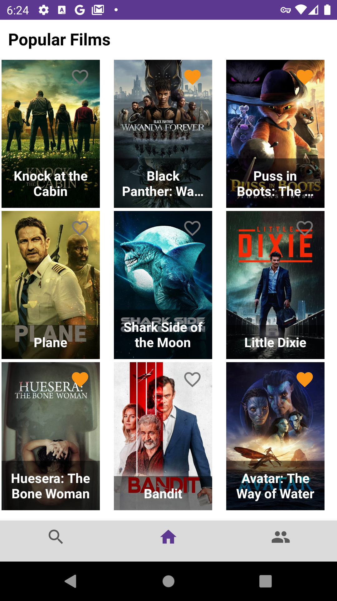
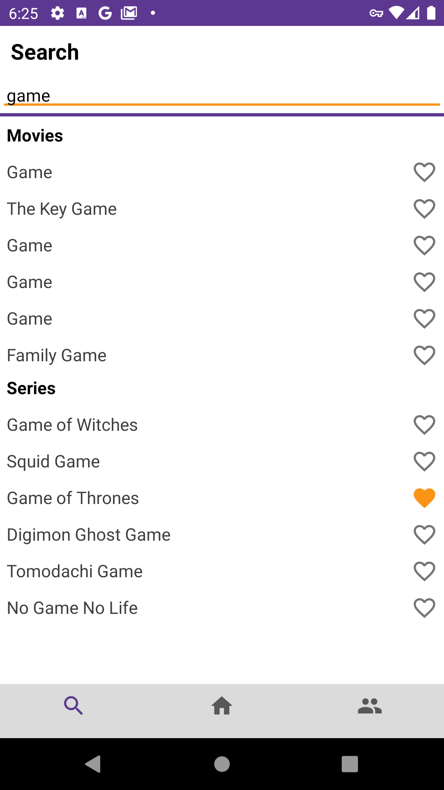
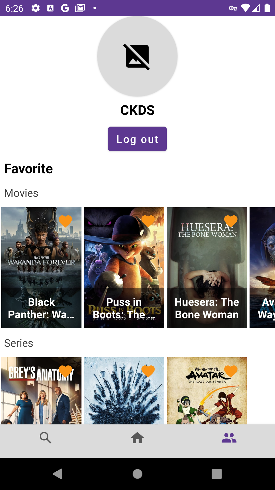
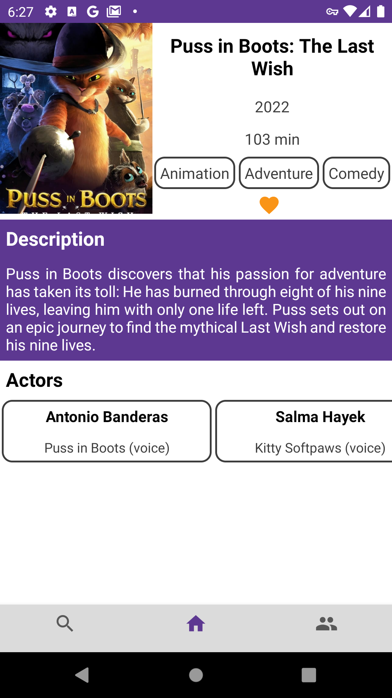

# Movie App

## About project

<b>Movie App</b> is the simple application for the movie.db API (https://www.themoviedb.org) on a popular stack.

## Technology Stack

Android SDK, Fragment, Kotlin, MVVM, NavigationComponents, ViewModel, Room, LiveData, KotlinCoroutines, Retrofit, Hilt, Glide.

## Screenshots

  
   

  
   

